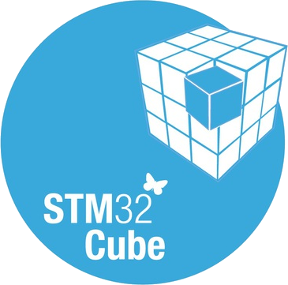
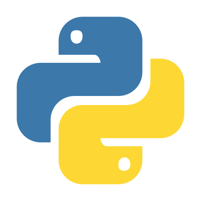

### Hi there 👋

<!--
**yunke120/yunke120** is a ✨ _special_ ✨ repository because its `README.md` (this file) appears on your GitHub profile.

Here are some ideas to get you started:

- 🔭 I’m currently working on ...
- 🌱 I’m currently learning ...
- 👯 I’m looking to collaborate on ...
- 🤔 I’m looking for help with ...
- 💬 Ask me about ...
- 📫 How to reach me: ...
- 😄 Pronouns: ...
- ⚡ Fun fact: ....
-->

<table><tr>
<td></td>
<td></td>
</tr></table>

**Platforms:**

<code></code> <code></code> 

**Tools:**

<code></code> <code></code> <code></code> <code></code> <code></code> 

**Languages:**

<code></code> <code></code> <code></code> <code></code> 

### Qt

### Algorithm

### ROS2

### SCM

### Python

### Programming

### Miscellaneous

